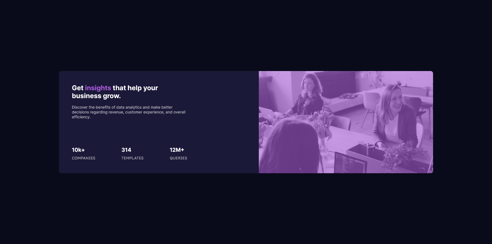

# Frontend Mentor - Stats preview card component solution

This is a solution to the [Stats preview card component challenge on Frontend Mentor](https://www.frontendmentor.io/challenges/stats-preview-card-component-8JqbgoU62). Frontend Mentor challenges help you improve your coding skills by building realistic projects. 

## Table of contents

- [Frontend Mentor - Stats preview card component solution](#frontend-mentor---stats-preview-card-component-solution)
  - [Table of contents](#table-of-contents)
  - [Overview](#overview)
    - [The challenge](#the-challenge)
    - [Screenshot](#screenshot)
    - [Links](#links)
  - [My process](#my-process)
    - [Built with](#built-with)
    - [What I learned](#what-i-learned)
    - [Continued development](#continued-development)
  - [Author](#author)


**Note: Delete this note and update the table of contents based on what sections you keep.**

## Overview

### The challenge

Users should be able to:

- View the optimal layout depending on their device's screen size

### Screenshot



### Links

- Solution URL: [Add solution URL here](https://your-solution-url.com)
- Live Site URL: [Add live site URL here](https://your-live-site-url.com)

## My process

### Built with

- Flexbox
- Mobile-first workflow
- [React](https://reactjs.org/) - JS library

### What I learned

In this I learned how to make responsive design using fix height, flex box, media query.

To see how you can add code snippets, see below:


```css
.stats-page {
    height: 400px;
    width: 76%;
    background-color: $dark-desaturated-blue;
    display: flex;
    border-radius: 10px;

    @media screen and (max-width: 850px) {
        width: 85%;
    }

    @media screen and (max-width: 720px) {
        // width: 85%;
        flex-direction: column-reverse;
        max-width: 380px;
        height: calc(100% - 40px);
    }
}
```


### Continued development

I would like to work on more responsive projects and Landing page .


## Author
- Frontend Mentor - [@bhaveshdaswani93](https://www.frontendmentor.io/profile/bhaveshdaswani93)
- Twitter - [@digitaldaswani](https://www.twitter.com/digitaldaswani)

